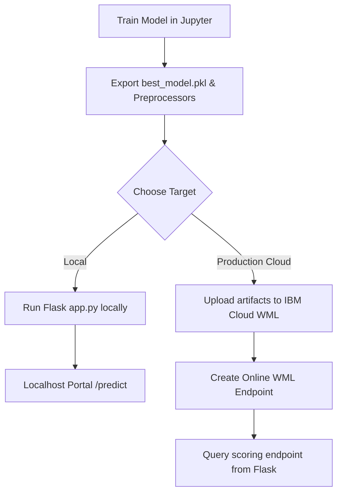

# Deployment Module

This directory contains the documentation, workflows, and scripts needed to deploy the **Credit Card Approval Prediction System** into target environments.

## Deployment Options

We support two primary modes of deployment:

### 1. [Local Deployment Guide](file:///c:/Users/laksh/CreditCard/09_Deployment/Local_Deployment.md)
* Details how to run the Flask application server on local environments (development, debugging, and demonstration).
* Leverages local file-system serialization of `best_model.pkl`, `scaler.pkl`, and `encoder.pkl`.

### 2. [IBM Watson Cloud Deployment Guide](file:///c:/Users/laksh/CreditCard/09_Deployment/IBM_Watson_Deployment.md)
* Details how to containerize and deploy the machine learning classifier using the **IBM Watson Machine Learning (WML)** Cloud platform.
* Integrates the cloud-hosted scoring endpoint back into the web portal for production use cases.

---

## Deployment Process Flow

For specific steps, please refer to the corresponding markdown files linked above.
