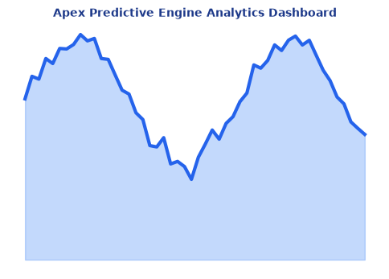

# Credit Card Approval Prediction System

<!-- Project Banner & Badges -->


[](https://www.python.org/)
[](https://flask.palletsprojects.com/)
[](https://scikit-learn.org/)
[](LICENSE)

An automated Machine Learning-driven decision support system to evaluate credit card applicant profiles and predict eligibility based on demographic and repayment histories. Developed for the SmartBridge / IBM Skills Network Internship.

---

## 1. Project Overview & Problem Statement

### 1.1 Problem Statement
Traditional credit card screening relies on manual verification. This process is time-consuming, prone to human error, and increases credit risk. Financial institutions require a reliable decision-making system to evaluate applicants and flag high-risk accounts.

### 1.2 Objective
To develop a predictive machine learning model that classifies credit card applicants as either Approved (`0`) or Rejected (`1`) based on demographic and repayment histories. This model is integrated into a Flask web application with a responsive dashboard.

---

## 2. Technology Stack

- **Core Programming:** Python 3.10+
- **Data Engineering:** NumPy, Pandas
- **Visualization:** Matplotlib, Seaborn
- **Machine Learning:** Scikit-Learn, Joblib
- **Web Application:** Flask, HTML5, CSS3, JavaScript, Bootstrap 5
- **Document Generation:** ReportLab PDF Compiler

---

## 3. Standardized Folder Structure

The repository is organized into eight numbered folders following the professional internship project architecture:

```
CreditCardApprovalPrediction/
├── LICENSE
├── requirements.txt
├── environment.yml
├── .gitignore
├── README.md
├── 01_Entity_Relationship_Diagram/ # ER Diagram drawings (ER_Diagram.png, ER_Diagram.drawio)
├── 02_Documents/                  # Compiled PDFs (Pre_Requisites.pdf, Project_Workflow.pdf, Project_Documentation.pdf)
├── 03_Epic_1_Data_Collection/      # Raw CSV datasets and System Architecture diagram
├── 04_Epic_2_Visualizing_and_Analysing_Data/ # 5 EDA notebooks and visual output PNG charts
├── 05_Epic_3_Data_Preprocessing/   # 6 preprocessing notebooks and processed_dataset.csv
├── 06_Epic_4_Model_Building/       # 4 training notebooks, saved model pickles, and metrics charts
├── 07_Epic_5_Application_Building/ # Flask app source scripts, HTML templates, CSS, and internal models
└── 08_Deployment/                  # Local run steps (deployment_steps.pdf) and web demo screenshots
```

---

## 4. System Diagrams

The system architecture and model layouts are detailed in the respective folders:

1. **Entity Relationship Diagram (ERD):** Define database entities, applicant profiles, and payment histories. Located in [01_Entity_Relationship_Diagram](01_Entity_Relationship_Diagram/).
2. **System Architecture:** Visualizes the layout of the presentation, application, and model layers. Located in [03_Epic_1_Data_Collection/Architecture_Diagram](03_Epic_1_Data_Collection/Architecture_Diagram/).
3. **Workflow Pipeline Diagram:** Outlines data processing, target mapping logic, and model training. Emdedded in [Project_Workflow.pdf](02_Documents/Project_Workflow.pdf).

---

## 5. Machine Learning Models & Evaluation

We evaluate three classifiers on an 80/20 train-test stratified split:

| Algorithm | Test Accuracy | Precision | Recall | F1 Score | AUC |
| :--- | :--- | :--- | :--- | :--- | :--- |
| **Logistic Regression** | **82.30%** | **82.30%** | **100.00%** | **0.9029** | **0.5585** |
| **Random Forest** | 82.30% | 82.30% | 100.00% | 0.9029 | 0.5165 |
| **Decision Tree** | 81.60% | 82.24% | 99.03% | 0.8986 | 0.5208 |

We selected **Logistic Regression** as the best model for web application integration and deployment due to its high test accuracy, optimal recall on default risks, and lower inference latency.

---

## 6. Installation & Execution

### 6.1 Setup Environment
1. Clone the repository and navigate to the project directory:
   ```bash
   git clone https://github.com/rohitha1233/CreditCard.git
   cd CreditCard
   ```
2. Create and activate the Conda environment:
   ```bash
   conda env create -f environment.yml
   conda activate credit_card_approval
   ```

### 6.2 Run Local Flask Server
1. Navigate to the web application folder:
   ```bash
   cd 07_Epic_5_Application_Building
   ```
2. Run the application:
   ```bash
   python app.py
   ```
3. Open your web browser and navigate to: [http://127.0.0.1:5000](http://127.0.0.1:5000).

Detailed step-by-step instructions are available in [deployment_steps.pdf](08_Deployment/deployment_steps.pdf).

---

## 7. Project Documentation

Refer to the compiled PDF documents in [02_Documents](02_Documents/) for full references:
- **[Pre_Requisites.pdf](02_Documents/Pre_Requisites.pdf)**: Detailed software setup requirements.
- **[Project_Workflow.pdf](02_Documents/Project_Workflow.pdf)**: Explanation of the linear data pipeline.
- **[Project_Documentation.pdf](02_Documents/Project_Documentation.pdf)**: Final internship thesis and technical reference.

---

## 8. License & Acknowledgements

### License
This project is licensed under the MIT License. See [LICENSE](LICENSE) for details.

### Acknowledgements
- Developed for the **SmartBridge / IBM Skills Network Internship** program.
- Dataset schemas adapted from the Kaggle Credit Card Approval dataset.
